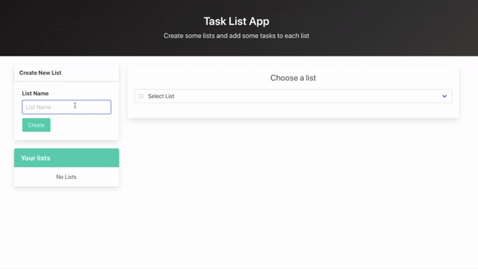

# Task list app

Application thanks to which you can create various lists of tasks, and in them specific tasks to be performed (using TS in React).

<br/>



<br/>

### Live version is available [here](https://task-list-app-ts.herokuapp.com/).

<br/>

## Table of contents

1. Technologies
2. Setup

<br/>

## 1. Technologiess

The following technologies were used in the project:

- React
- TypeScript
- Bulma
- Redux

<br/>

## 2. Setup

First of all, you need to make sure you have [Node.js](https://nodejs.org/en/) installed.

If you have Node.js installed clone the github repo.

Open the project in your favourite IDE and run following script for downloading dependencies:

```
npm install
# or
yarn install
```

After that, run the development server:

```
npm run dev
# or
yarn run dev
```

Open [http://localhost:3000](http://localhost:3000) with your browser to see the result.

<br/>

The server.js file with basic server implementation was created for the deployment to the heroku server (that's why under the npm start command there is a script that starts the production server by heroku service (instead of the react development server), which serves the previously built application). This solution was introduced becouse of TypeScript specification.
